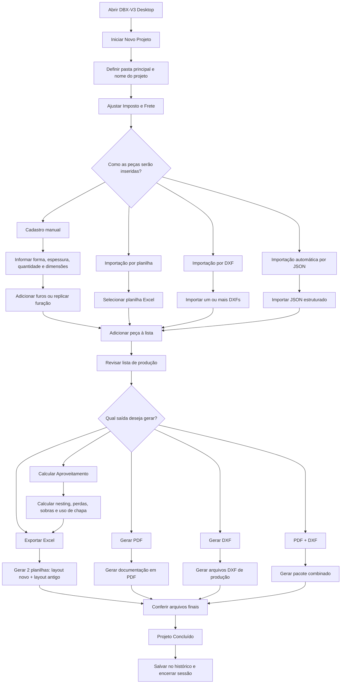

# DBX-V3 Desktop

Aplicação desktop para montagem de listas de peças, cálculo técnico de produção e geração de saídas comerciais e operacionais para corte Plasma, Laser e Guilhotina.

O objetivo do DBX-V3 é transformar um fluxo que normalmente fica espalhado entre Excel, desenhos, anotações manuais e conferências operacionais em um processo único: cadastrar as peças, revisar os dados, calcular aproveitamento e gerar os arquivos finais do orçamento e da produção.

## Para Quem É

- Empresas de corte e conformação que precisam orçar e organizar lotes de peças com rapidez.
- Operações que trabalham com Plasma, Laser ou Guilhotina.
- Times comerciais, PCP, engenharia e produção que precisam falar a mesma linguagem de dados.
- Clientes que recebem peças por planilha, DXF, desenho técnico ou cadastro manual.

## O Que A Aplicação Faz

- Cria e organiza projetos por pasta.
- Permite cadastrar peças manualmente.
- Importa peças por planilha Excel.
- Importa geometrias DXF.
- Gera código interno de peça com base configurável.
- Permite adicionar e replicar furos.
- Consolida tudo em uma lista única de produção.
- Exporta orçamento em Excel nos layouts novo e antigo.
- Gera PDF, DXF e pacote PDF + DXF.
- Calcula aproveitamento de chapa e perdas por espessura.
- Mantém histórico de projetos concluídos.
- Já vem preparada para upload automático via JSON e evolução futura com IA.

## Fluxograma Geral

## Jornada de Uso Passo a Passo

### 1. Início do projeto

1. Clique em `Iniciar Novo Projeto...`.
2. Escolha a pasta principal onde o projeto será salvo.
3. Informe o número ou nome do projeto.
4. A aplicação cria a pasta do projeto e passa a usar esse diretório como base para todas as saídas.

### 2. Ajuste de parâmetros de custo

Antes de gerar orçamento ou arquivos finais, revise:

- `Imposto`
- `Frete`

Esses parâmetros alimentam a exportação do orçamento e influenciam a composição comercial da planilha.

### 3. Escolha a forma de entrada das peças

O DBX-V3 foi desenhado para aceitar diferentes tipos de operação. Você pode usar apenas uma entrada ou combinar várias no mesmo projeto.

#### Opção A. Cadastro manual

Use quando a peça ainda está em conferência, veio por desenho simples ou precisa ser lançada rapidamente.

Fluxo:

1. Preencha `Nome/ID da Peça`.
2. Escolha a `Forma`.
3. Informe `Espessura` e `Quantidade`.
4. Preencha as dimensões conforme a forma:
   - Retângulo ou quadrado: largura e altura
   - Círculo: diâmetro
   - Triângulo retângulo: base e altura
   - Trapézio: base maior, base menor e altura
5. Clique em `Gerar Código` se quiser criar um código interno padrão.
6. Adicione furos, se necessário.
7. Clique em `Adicionar Peça à Lista`.

#### Opção B. Importação por planilha

Use quando o cliente já envia um lote estruturado em Excel.

Fluxo:

1. Abra `Arquivos Base`.
2. Baixe a `planilha-dbx.xlsx`.
3. Preencha uma linha por peça.
4. Salve o arquivo.
5. Na tela principal, clique em `Selecionar Planilha`.
6. A lista de peças é carregada para a tabela de produção.

Campos comuns aceitos:

- `nome_arquivo`
- `forma`
- `espessura`
- `qtd`
- `largura`
- `altura`
- `diametro`
- grupos de furos como `furo_1_diametro`, `furo_1_x`, `furo_1_y`

#### Opção C. Importação por DXF

Use quando a geometria já existe em CAD e você quer acelerar a preparação da produção.

Fluxo:

1. Clique em `Importar DXF(s)`.
2. Selecione um ou vários arquivos.
3. O sistema lê a geometria e traz os itens para a sessão.
4. Revise a lista antes de exportar.

#### Opção D. Importação automática por JSON

Use quando as peças vierem de uma integração externa ou de um pipeline assistido por IA.

Fluxo:

1. Acesse a `Sessão Upload Automático`.
2. Importe um arquivo JSON.
3. O DBX-V3 normaliza os dados.
4. As peças são inseridas na lista de produção.

Esse fluxo já está preparado para evolução futura com leitura de imagens e desenhos por IA especializada.

## Como Funciona a Furação

Depois de cadastrar uma peça, a aplicação permite complementar a geometria com furos.

### Furação rápida

Indicada para peças retangulares com padrão repetitivo.

Fluxo:

1. Informe os parâmetros da furação.
2. Clique em `Replicar Furos`.
3. O sistema distribui os furos conforme a regra escolhida.

### Furos manuais

Indicada para peças especiais ou casos em que cada furo precisa ser lançado individualmente.

Fluxo:

1. Informe diâmetro.
2. Informe coordenadas `X` e `Y`.
3. Clique em `Adicionar Furo Manual`.
4. Revise a lista temporária de furos antes de enviar a peça para a lista principal.

## Lista de Produção

Toda peça lançada por qualquer uma das entradas cai na mesma tabela central.

Essa lista é o coração do fluxo porque ela concentra:

- peças cadastradas manualmente
- peças importadas por Excel
- peças vindas de DXF
- peças vindas de JSON

Antes de gerar qualquer saída, o operador deve revisar:

- identificação da peça
- espessura
- quantidade
- dimensões
- furação
- consistência geral do lote

## Saídas Geradas Pela Aplicação

### 1. Exportar Excel

Ao exportar o orçamento, o sistema gera duas planilhas automaticamente:

- `layout novo`
- `layout antigo`

Objetivo:

- permitir continuidade operacional com o layout oficial atual
- manter compatibilidade com clientes e fluxos internos que ainda usam a planilha antiga

O preenchimento inclui:

- dados das peças
- espessuras
- dimensões
- largura comercial da matéria-prima
- perdas calculadas
- aproveitamento
- resumo técnico e comercial

### 2. Gerar PDF

Use quando precisar de uma saída documental para envio, conferência interna ou aprovação.

### 3. Gerar DXF

Use quando o próximo passo é encaminhar os desenhos para produção ou para um fluxo CAD/CAM.

### 4. PDF + DXF

Use quando o projeto precisa sair completo em um único processamento.

### 5. Aproveitamento

Esse fluxo faz o cálculo técnico de nesting e eficiência da chapa.

Ele considera:

- largura e altura da chapa
- método de corte
- offset entre peças
- margem da chapa
- agrupamento por espessura

Saídas do cálculo:

- total de chapas
- percentual de aproveitamento
- peso total das chapas
- perdas
- sobras aproveitáveis
- sucatas dimensionadas
- perda média ponderada

## Projeto Concluído e Histórico

Quando a revisão estiver pronta:

1. Clique em `Projeto Concluído`.
2. O projeto é registrado no histórico.
3. A sessão atual é encerrada.
4. Depois você pode reabrir trabalhos anteriores em `Ver Histórico de Projetos`.

Esse fluxo ajuda a manter rastreabilidade e reduz o retrabalho em projetos recorrentes.

## Arquivos Base Disponíveis

A aplicação possui uma área dedicada chamada `Arquivos Base`.

Lá o usuário pode:

- baixar a `planilha-dbx.xlsx`
- baixar o `codigo_database.xlsx`
- instalar uma base personalizada de códigos
- abrir a pasta de dados ativa da aplicação
- baixar o pacote completo com os arquivos de apoio

### `planilha-dbx.xlsx`

Modelo para cadastro em lote de peças.

### `codigo_database.xlsx`

Base usada pelo botão `Gerar Código`.

Se a empresa quiser prefixos próprios, basta editar a célula `D2`, salvar o arquivo e instalar a nova base na aplicação.

## Fluxo Recomendado Para Novos Clientes

Se o cliente estiver começando agora, a melhor sequência é:

1. Baixar o pacote completo em `Arquivos Base`.
2. Iniciar um projeto teste.
3. Preencher a planilha modelo com um lote simples.
4. Importar esse lote no DBX-V3.
5. Revisar as peças na lista central.
6. Rodar `Aproveitamento`.
7. Exportar o Excel.
8. Validar os dois layouts de orçamento.
9. Gerar PDF e DXF quando necessário.
10. Concluir o projeto e conferir o histórico.

## Benefícios Práticos

- Menos retrabalho entre comercial e produção.
- Menos dependência de ajustes manuais em Excel.
- Maior padronização no cadastro de peças.
- Mais velocidade para montar orçamento e documentação.
- Melhor visão de perdas, sobras e aproveitamento.
- Compatibilidade com operação antiga e nova ao mesmo tempo.

## Estrutura Técnica do Desktop

- `desktop_app/main_window.py`: janela principal e orquestração da interface
- `desktop_app/history_dialog.py`: visualização do histórico
- `desktop_app/nesting_dialog.py`: cálculo de aproveitamento
- `desktop_app/processing.py`: processamento em thread para geração de saídas
- `calculo_cortes.py`: motor de cálculo de planos de corte
- `dxf_engine.py`: leitura e suporte a DXF

## Executar Localmente

1. Rode `build_desktop.ps1` para criar o ambiente local e instalar dependências.
2. Para abrir a aplicação sem build, execute `start_desktop.bat`.

## Build

- Local: `.\build_desktop.ps1`
- CI: o workflow `build-desktop.yml` gera o artefato em Windows a cada push.
