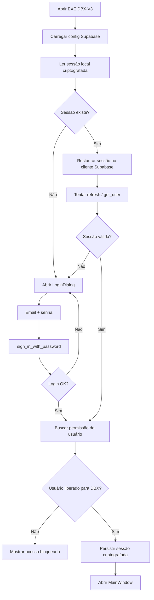

# Roadmap de Autenticação Supabase para o DBX-V3 Desktop

## Objetivo

Implementar autenticação obrigatória no EXE do DBX-V3 usando `Supabase Auth`, sem quebrar o fluxo atual de cadastro, importação e exportação já estável da aplicação.

O usuário só poderá usar o DBX após autenticação bem-sucedida e validação de permissão de acesso.

## Princípios de Arquitetura

### 1. O EXE nunca deve conter `service_role`

No aplicativo desktop vamos usar apenas:

- `SUPABASE_URL`
- `SUPABASE_ANON_KEY`

Tudo que for administrativo deve ficar fora do EXE:

- criação de usuários
- convite de usuários
- reset administrativo
- bloqueio e desbloqueio
- alteração de `app_metadata`
- gestão de roles e permissões

Essas ações devem acontecer por um destes canais:

- Supabase Dashboard
- Edge Functions
- painel admin separado

### 2. Autenticação e autorização são camadas diferentes

Precisamos de duas validações:

1. O usuário existe e autenticou com sucesso.
2. O usuário tem direito de usar o DBX.

Autenticar sem autorizar não basta.

### 3. Implantação por fases

Não vamos plugar tudo de uma vez na janela principal.

A estratégia correta é:

1. preparar a infraestrutura no Supabase
2. criar um guard de autenticação antes do `MainWindow`
3. persistir sessão com segurança
4. validar acesso do usuário
5. só depois bloquear totalmente o uso sem login

## Arquitetura Recomendada para o Desktop

## Decisão de Produto Recomendada para a Fase 1

Para o primeiro rollout, a recomendação é:

- login por `email + senha`
- cadastro público desabilitado
- acesso por convite ou criação manual feita por admin
- confirmação de email ligada no projeto
- autorização por `app_metadata` e tabela `profiles`
- persistência local de sessão com criptografia no Windows

### Por que esse desenho é o mais seguro no início

- evita complexidade de redirect de navegador para o EXE
- evita depender de magic link logo na fase inicial
- simplifica o suporte ao usuário
- reduz risco de quebrar o app atual
- deixa o MFA como evolução controlada da fase 2

## Roadmap de Infraestrutura no Supabase Dashboard

## Fase 0. Preparar ambientes

### Recomendação

Criar pelo menos dois projetos Supabase:

- `dbx-auth-dev`
- `dbx-auth-prod`

Idealmente:

- `dbx-auth-dev`
- `dbx-auth-staging`
- `dbx-auth-prod`

### Resultado esperado

- desenvolvimento sem tocar produção
- testes reais com usuários de homologação
- promoção controlada depois da validação

## Fase 1. Criar o projeto Supabase

No dashboard:

1. Crie um novo projeto Supabase para `DEV`.
2. Salve:
   - `Project URL`
   - `anon public key`
3. Não use a `service_role` no EXE.

### Variáveis que o desktop vai consumir

- `SUPABASE_URL`
- `SUPABASE_ANON_KEY`
- `SUPABASE_PROJECT_ENV`

## Fase 2. Configurar Auth no Dashboard

Menu recomendado:

- `Authentication`
- `Providers`
- `URL Configuration`
- `Email Templates`
- `Users`

### 2.1 Providers

Para a fase inicial:

- `Email` = habilitado
- `Phone` = desabilitado
- `Anonymous` = desabilitado
- provedores sociais = desabilitados

### 2.2 Política de cadastro

Recomendação:

- `Allow new users to sign up` = desabilitado

Isso deixa o ambiente em modo controlado:

- só admins liberam novos usuários
- reduz risco de uso indevido
- melhora o controle comercial da base

### 2.3 Confirmação de email

Recomendação:

- `Confirm email` = habilitado

Observação:

Se o onboarding inicial for 100% manual pelo admin, o usuário pode ser criado ou confirmado administrativamente para reduzir atrito durante a homologação.

### 2.4 URL Configuration

Mesmo sendo um EXE, configure isso no Dashboard.

Defina:

- `Site URL`
- `Redirect URLs`

Recomendação prática:

- usar um domínio de apoio do projeto, por exemplo `https://auth.dbx.seudominio.com`

Isso será importante para:

- confirmação de cadastro
- recuperação de senha
- convites
- futuros fluxos híbridos Web + Desktop

### 2.5 SMTP

Para produção, planeje SMTP próprio.

Motivo:

- controle de reputação
- consistência de entrega
- domínio da empresa
- personalização de remetente e templates

### 2.6 Templates de email

Personalizar no dashboard:

- `Confirm signup`
- `Invite user`
- `Reset password`
- `Change email`

Recomendações:

- usar branding DBX
- incluir instruções claras
- explicar que o acesso é para o aplicativo DBX-V3

## Fase 3. Configurar política de senha e sessão

No dashboard, defina uma política conservadora.

### Recomendação inicial

- senha mínima de 10 a 12 caracteres
- exigir combinação forte
- proteção contra senhas vazadas quando disponível
- expiração curta do access token
- refresh token persistido localmente

### Política operacional sugerida

- access token curto
- refresh automático ao abrir o app
- logout explícito no desktop

### Decisões para validar em homologação

- permitir múltiplas sessões por usuário ou não
- tempo máximo de sessão
- tolerância para uso em mais de um equipamento

## Fase 4. Criar estrutura de autorização

Só o Auth não resolve o controle de licença/acesso.

Precisamos de uma camada de autorização.

## Estrutura recomendada

### Tabela `public.profiles`

Campos sugeridos:

- `id uuid primary key`
- `user_id uuid unique references auth.users(id)`
- `email text`
- `display_name text`
- `company_id uuid null`
- `status text`
- `desktop_access boolean`
- `created_at timestamptz`
- `updated_at timestamptz`

### `app_metadata` no usuário

Usar para itens sensíveis de autorização:

- `roles`
- `dbx_access`
- `plan`
- `environment`

### Separação recomendada

- `app_metadata` = autorização e controle sensível
- `user_metadata` = informação editável pelo usuário
- `profiles` = dados operacionais e de exibição

## Fase 5. Ativar RLS

Toda tabela exposta via API deve usar `RLS`.

Para `profiles`:

1. criar tabela
2. habilitar `row level security`
3. permitir que o usuário leia apenas o próprio perfil
4. permitir update apenas no que fizer sentido
5. reservar ações administrativas para backend/edge/service role

### Política mínima recomendada

- `SELECT`: usuário autenticado lê o próprio registro
- `UPDATE`: usuário autenticado atualiza apenas os próprios campos permitidos
- `INSERT`: criado via trigger ou backend

## Fase 6. Trigger de criação de perfil

Ao criar usuário no Auth, gerar automaticamente o perfil na tabela `profiles`.

Fluxo sugerido:

1. usuário criado em `auth.users`
2. trigger insere em `public.profiles`
3. perfil nasce com:
   - `status = pending`
   - `desktop_access = false`

Depois disso o admin libera acesso.

## Fase 7. Gestão de usuários no Dashboard

Enquanto não existir painel admin próprio, o processo operacional recomendado é:

1. Admin cria ou convida o usuário no Supabase Dashboard.
2. Admin define `app_metadata.dbx_access = true`.
3. Admin ajusta `roles` ou `plan`, se necessário.
4. Trigger cria o `profile`.
5. Usuário faz login no EXE.
6. O app valida autenticação + autorização antes de abrir.

## Roadmap de Implementação no Código do Desktop

## Etapa A. Fundamentos de integração

Adicionar uma camada de auth isolada, sem mexer ainda na lógica de produção.

Arquivos sugeridos:

- `desktop_app/auth/config.py`
- `desktop_app/auth/client.py`
- `desktop_app/auth/session_store.py`
- `desktop_app/auth/service.py`
- `desktop_app/auth/models.py`

Responsabilidades:

- carregar config
- inicializar cliente Supabase
- persistir sessão
- restaurar sessão
- refresh de token
- buscar usuário atual
- validar autorização

## Etapa B. Persistência segura de sessão

Como o app é Windows desktop, a recomendação é usar criptografia local.

Opção recomendada:

- `Windows DPAPI` via `pywin32`

Fluxo:

1. login bem-sucedido
2. sessão salva em pasta da aplicação
3. conteúdo criptografado localmente
4. na próxima abertura o app tenta restaurar a sessão

### Pasta sugerida

`%LOCALAPPDATA%/DBX-V3 Desktop/auth/`

Arquivos sugeridos:

- `session.bin`
- `session_meta.json`

## Etapa C. Tela de login antes da MainWindow

Criar um `LoginDialog` desacoplado da tela principal.

Fluxo:

1. app abre
2. tenta restaurar sessão
3. se não houver sessão válida, abre `LoginDialog`
4. só instancia `MainWindow` após autenticação válida

Componentes sugeridos:

- email
- senha
- botão entrar
- botão sair
- botão esqueci minha senha
- indicador de conexão/autenticação

## Etapa D. Bloqueio de uso sem autenticação

Depois da etapa C validada, o uso do DBX passa a depender obrigatoriamente de login.

Critério:

- `MainWindow` só abre se o usuário estiver autenticado e autorizado

## Etapa E. Validação de autorização

Depois do login, validar:

- usuário autenticado
- `app_metadata.dbx_access == true`
- `profiles.desktop_access == true`
- `profiles.status == active`

Se qualquer regra falhar:

- não abrir a aplicação
- mostrar mensagem amigável
- orientar o usuário a contatar o administrador

## Etapa F. Logout e troca de conta

Adicionar no desktop:

- ação de logout
- limpeza de sessão local
- retorno para a tela de login

## Etapa G. Recuperação de senha

Para não complicar a fase inicial do EXE:

- o botão `Esqueci minha senha` pode disparar o fluxo padrão do Supabase
- em paralelo, o dashboard precisa estar com `Site URL`, `Redirect URLs` e template configurados

## Etapa H. Observabilidade e auditoria

Registrar no mínimo:

- login bem-sucedido
- falha de login
- sessão expirada
- acesso bloqueado por permissão
- logout

Pode ser feito inicialmente em:

- log local da aplicação

E depois evoluir para:

- tabela de auditoria
- Edge Function
- integração com monitoramento

## Roadmap de Liberação por Fases

## Fase 1. Homologação técnica

Entregas:

- projeto Supabase DEV
- email/senha funcionando
- sessão restaurável
- `MainWindow` protegida por login

Sem entrar ainda em:

- MFA
- painel admin
- billing/licença sofisticada

## Fase 2. Homologação operacional

Entregas:

- convite de usuários
- bloqueio e desbloqueio via dashboard
- perfil e autorização
- reset de senha funcional
- testes com usuários reais de validação

## Fase 3. Hardening

Entregas:

- MFA opcional ou obrigatório por perfil
- políticas mais rígidas de sessão
- logs de auditoria
- rate limiting revisado
- onboarding padronizado

## Fase 4. Produção

Só promover quando estas condições forem verdadeiras:

- login estável por vários ciclos de uso
- recuperação de senha validada
- usuários bloqueados não entram
- sessão expirada é tratada sem travar o app
- logout funciona
- suporte interno sabe criar, liberar e revogar usuários

## Checklist de Dashboard para DEV

- projeto DEV criado
- Email provider habilitado
- cadastro público desabilitado
- phone auth desabilitado
- providers sociais desabilitados
- `Site URL` configurado
- `Redirect URLs` configurados
- templates de email revisados
- SMTP planejado ou configurado
- tabela `profiles` criada
- RLS habilitado
- policies criadas
- trigger de criação de perfil criada
- estratégia de `app_metadata` definida

## Checklist de Código para a Branch

- cliente Supabase isolado
- config via ambiente/arquivo seguro
- `LoginDialog`
- `SessionStore` criptografado
- `AuthGuard` antes do `MainWindow`
- logout
- restore session
- refresh session
- checagem de autorização
- mensagens de erro claras

## Riscos que Precisamos Evitar

- expor `service_role` dentro do EXE
- acoplar login direto na `MainWindow`
- liberar acesso só porque o login passou
- guardar token sem criptografia local
- depender de magic link logo na primeira versão
- ativar tudo em produção antes da homologação

## Próxima Execução Recomendada na Branch

Ordem ideal de trabalho:

1. adicionar dependência do cliente Supabase para Python
2. criar módulo `desktop_app/auth/`
3. implementar `config + client + session_store`
4. criar `LoginDialog`
5. colocar `AuthGuard` no `main()`
6. testar login e restore de sessão
7. validar autorização por `profiles` e `app_metadata`
8. só então tornar autenticação obrigatória em definitivo

## Referências Oficiais

- Supabase Auth architecture: https://supabase.com/docs/guides/auth/architecture
- Password-based Auth: https://supabase.com/docs/guides/auth/passwords
- Email templates: https://supabase.com/docs/guides/auth/auth-email-templates
- RLS com Auth: https://supabase.com/docs/learn/auth-deep-dive/auth-row-level-security
- Python auth admin reference: https://supabase.com/docs/reference/python/auth-admin-updateuserbyid
